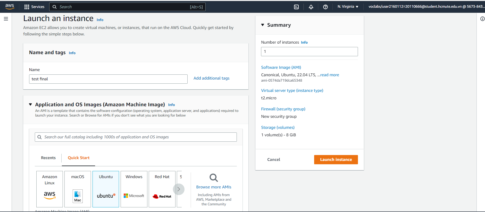

# TÊN ĐỀ TÀI "TÌM HIỂU VỀ DỊCH VỤ SNS & SQS CỦA AMAZON WEB SERVICE"
## Project Name: Cloud_AWS_SNS_SQS

### Project use DynamoDB + EC2 + Lambda + VPC + SQS + SNS

### 🔗 Thành viên
1. Đỗ Thị Mỹ Lan - 20110666
2. Bùi Quốc Tĩnh - 20110737
3. Nguyễn Hữu Đạt - 20110630

### 🔗 Các chức năng chính
- Đăng ký tài khoản trên website
- Đăng nhập vào hệ thống
- Thay đổi số dư trong tài khoản
- Gửi tin nhắn đến khách hàng qua email về sự thay đổi số dư này.

## Deploy Web lên AWS
Tạo một instance trên EC2
